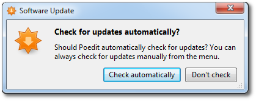
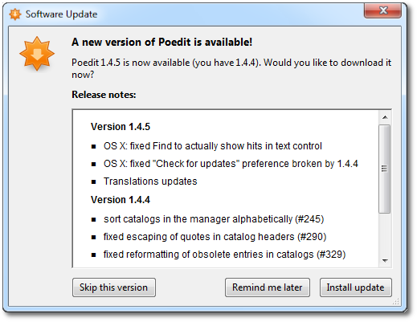

## Enabling and checking for updates

When the application is launched for the first time, WinSparkle does nothing
yet, so that it doesn't distort the user's first impression of the app. It's
only when the user uses the app for the second time that they are asked if they
want to check for updated versions:

If the user agrees, WinSparkle will look for updates periodically on app
startup. No UI is shown during the check; everything happens silently in the
background. When a newer version appears in the appcast, WinSparkle pops up a
window with information about the update, including HTML release notes if they
are provided:

Users can skip an update if it isn't worth downloading for them, or if they're
too busy at the moment. _Remind me later_ simply postpones the notification
until the next time the app is used.

_Install update_ downloads the new version's installer and launches it.
